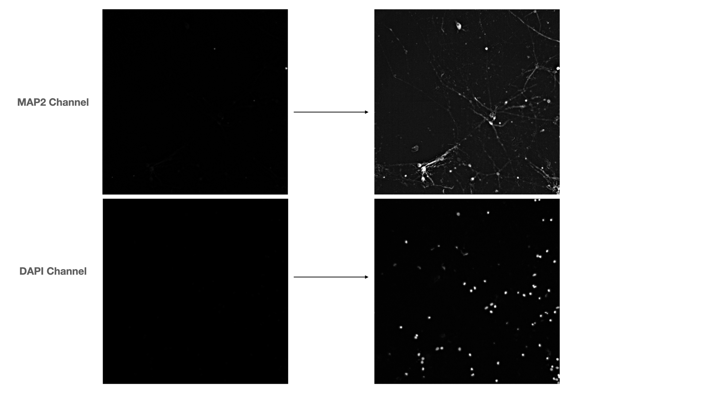

# drug-induced_morphology_changes_quantification
I treated iPSC with FDA approved drugs, stained them with neurite and nuclear markers and obtained confocal fluorescent images. Now, the goal is to quantify the change of neurites in each condition, namely 3 parameters: amount of trunk-branches (neurite branching from the body of the cell), non-trunk branching and mean length of neurites.

#Preamble
Human iPSC cells expressing abnormal HTT gene (mHTT) that plays an important role in Huntington's disease (HD) were cultured in 368-well plate, differentiated for 30 days and treated with a variety of FDA-approved substances for 48 hours.

After that, the cells were fixed and immunostained with fluorescent MAP2 antibody (a marker of neuronal dendrites), DAPI (nuclear marker) and anti-mHTT antibody.

Then, images were acquired using confocal microscope "Leica Thunder". For each well, 9 images were acquired for each channel, capturing each fluorescent signal separately.

The goal of the current analysis is to see if any changes in the cell morphology (specifically dendrites) are detectable after drug treatment. This analysis starts from the raw "ICC" (computationally cleared) images from Leica Thunder microscope. The softwares used was ImageJ version 1.53a and CellProfiler version 4.2.0. Statistical analysis and graphs done in Python3.

## 1. Raw images processing by ImageJ
Leica Thunder outputs the images in the .tif format. A plugin called "BioFormats" is needed to be able to open these images in ImageJ. The raw images are heavy so only a small subset (3 wells) are provided here in the link: https://drive.google.com/file/d/1-_7npYH_gfL7ygdyEGdGy22dfrbRwSuL/view?usp=sharing

The ImageJ macro provided (teat_macro_5jul.ijm) should be changed in the line

`saveAs("PNG", "/Users/maxxim333/Desktop/herrington/05_jul/imagej_output/"+originalName+"_cl.png");`

to match the desired output directory on your machine.

When running the macro (in Macro>Run) on ImageJ, it will ask you for input directory twice. Choose the same folder twice and let the program run. The macro does two things:
1. Automatically adjusts brightness and contrast of the image
2. Runs "despeckle" function that cleans the image from fluorescent noise a little bit.

The macro transforms &nbsp; &nbsp;&nbsp;&nbsp;  THIS &nbsp;  &nbsp;  &nbsp;  &nbsp;  &nbsp;  &nbsp;  &nbsp;  &nbsp;   into  &nbsp;  &nbsp;  &nbsp;  &nbsp; &nbsp;  &nbsp;  &nbsp;  &nbsp;  &nbsp;  &nbsp;  &nbsp;  &nbsp;  &nbsp; &nbsp; &nbsp;  THIS

 

## 2. Quantification of cell morphological parameters by CellProfiler
The PNG images outputed by ImageJ will serve as input data for CellProfiler. For each of the 9 images of each of the wells, it will identify and separate the nuclei based on the signal from DAPI channel. Then, it will superpose the MAP2 signal over the identified nuclei, "skeletize" the neurons (i.e. transform the neurite outlied in a one-pixel wide lines. From this superposed images, it will extract (for each nuclei) four main parameters:
1. The amount of neurites that originates from the nucleus.
2. The amount of branching points of all the neurons that originates from one particular nuclei
3. The amount of branch-ends
4. Total lenght of the neurites

From these parameters, one could losely infer the morphology of the neuron as exemplified below:

