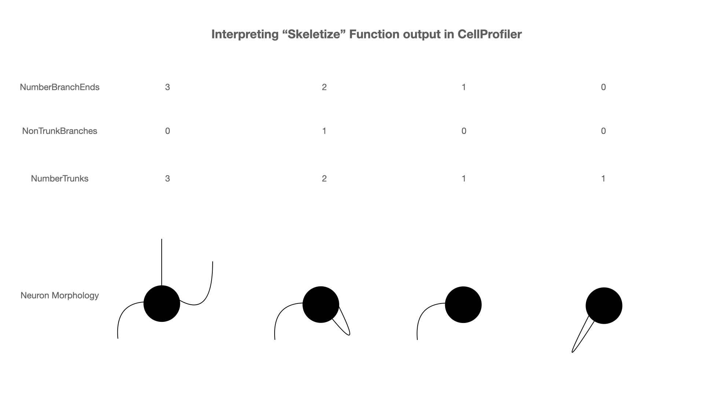
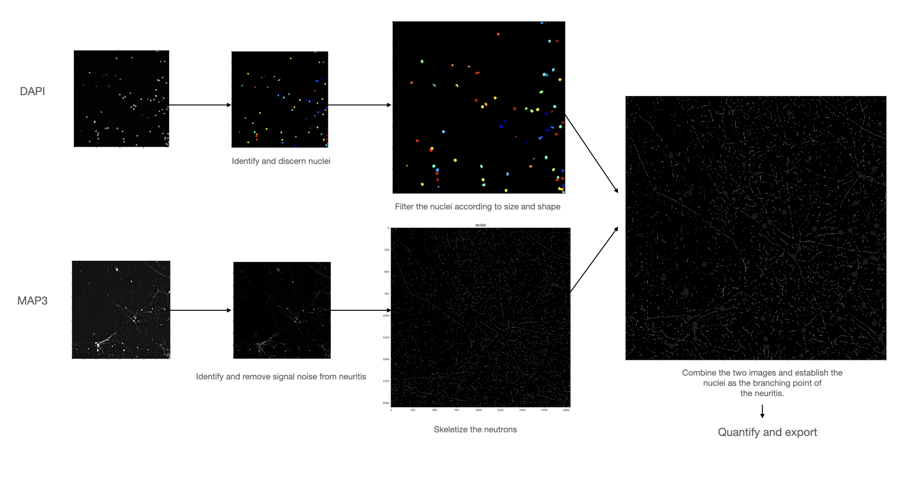

# drug-induced_morphology_changes_quantification
I treated iPSC with FDA approved drugs, stained them with neurite and nuclear markers and obtained confocal fluorescent images. Now, the goal is to quantify the change of neurites in each condition, namely 3 parameters: amount of trunk-branches (neurite branching from the body of the cell), non-trunk branching and mean length of neurites.

#Preamble
Human iPSC cells expressing abnormal HTT gene (mHTT) that plays an important role in Huntington's disease (HD) were cultured in 368-well plate, differentiated for 30 days and treated with a variety of FDA-approved substances for 48 hours.

After that, the cells were fixed and immunostained with fluorescent MAP2 antibody (a marker of neuronal dendrites), DAPI (nuclear marker) and anti-mHTT antibody.

Then, images were acquired using confocal microscope "Leica Thunder". For each well, 9 images were acquired for each channel, capturing each fluorescent signal separately.

The goal of the current analysis is to see if any changes in the cell morphology (specifically dendrites) are detectable after drug treatment. This analysis starts from the raw "ICC" (computationally cleared) images from Leica Thunder microscope. The softwares used was ImageJ version 1.53a and CellProfiler version 4.2.0. Statistical analysis and graphs done in Python3.

## 1. Raw images processing by ImageJ
Leica Thunder outputs the images in the .tif format. A plugin called "BioFormats" is needed to be able to open these images in ImageJ. The raw images are heavy so only a small subset (3 wells) are provided here in the link: https://drive.google.com/file/d/1-_7npYH_gfL7ygdyEGdGy22dfrbRwSuL/view?usp=sharing

The ImageJ macro provided (teat_macro_5jul.ijm) should be changed in the line

`saveAs("PNG", "/Users/maxxim333/Desktop/herrington/05_jul/imagej_output/"+originalName+"_cl.png");`

to match the desired output directory on your machine.

When running the macro (in Macro>Run) on ImageJ, it will ask you for input directory twice. Choose the same folder twice and let the program run. The macro does two things:
1. Automatically adjusts brightness and contrast of the image
2. Runs "despeckle" function that cleans the image from fluorescent noise a little bit.

The macro transforms &nbsp; &nbsp;&nbsp;&nbsp;  THIS &nbsp;  &nbsp;  &nbsp;  &nbsp;  &nbsp;  &nbsp;  &nbsp;  &nbsp;   into  &nbsp;  &nbsp;  &nbsp;  &nbsp; &nbsp;  &nbsp;  &nbsp;  &nbsp;  &nbsp;  &nbsp;  &nbsp;  &nbsp;  &nbsp; &nbsp; &nbsp;  THIS

 

## 2. Quantification of cell morphological parameters by CellProfiler
The PNG images outputed by ImageJ will serve as input data for CellProfiler. For each of the 9 images of each of the wells, it will identify and separate the nuclei based on the signal from DAPI channel. Then, it will superpose the MAP2 signal over the identified nuclei, "skeletize" the neurons (i.e. transform the neurite outlied in a one-pixel wide lines. From this superposed images, it will extract (for each nuclei) four main parameters:
1. The amount of neurites that originates from the nucleus.
2. The amount of branching points of all the neurons that originates from one particular nuclei
3. The amount of branch-ends
4. Total lenght of the neurites

It also calculates the means, medians and standart deviations of these metrics.

From these parameters, one could losely infer the morphology of the neuron as exemplified below:

The CellProfiler pipeline is provided ("pipeline_29jun.cpproj" file and when loaded, the following parameters need to be changed in order to match the directories of the new machine:
- In the "Images" step, output images from ImageJ macro should be loaded and the old ones removed from the list of images to process. 
- In "NamesAndTypes", click "Update". The images should be nicely paired. Each pair needs to have a DAPI and a MAP3 image and there should not be any unpaired images.
- In the OutputToSpreadsheet step, the "Default location" for the output needs to be changed.

After these changes, the program can be run. Ignore any messages that might arrise due to unused steps. The pipeline has some legacy steps. The steps the pipeline will do are illustrated in the image below.

The relevant data for this data will be stored in the specified output folder in a csv under the name of "MyExpt_Image.csv" and this csv will be the input of the python script that will compute and represent all relevant statistics.

## Statistical Analysis
The python script will analyse groups of nine rows (because we have 9 images per well, and therefore  nine rows of output per well in the csv file). Then, it will calculate the means and standart deviations of each cluster of 9 parameters means. The final output will include only statistics for those drugs that have at least one of the parameters above the control with p-value <=0.05 measured by Welch's t-test.

The file provided here called "MyExpt_Image_all.csv" can be used as input and it corresponds to a result of running ImageJ macro and CellProfiler pipeline on 288 wells (2592 image pairs).

The lines that need to be changed in the script are:

`with open('/Users/maxxim333/Desktop/herrington/05_jul/MyExpt_Image_all.csv') as file:` to desired input file name and location of said input file.

If working with a file different from the one provided, there is a need to change these lines:

`number_of_wells=288` to the number of wells you are working with (will always be number of images divided by 9)

`control = (array[np.r_[51:54,99:102,147:150,195:198]]).reshape(-1)` to specify which of the wells correspond to control (untreated wells)

The following chunk of code should include indices of the wells corresponding to control wells instead of the existing ones:

    `del means[52:55], means[97:100], means[142:145], means[187:190]`
    `del standart_deviations[52:55], standart_deviations[97:100], standart_deviations[142:145], standart_deviations[187:190]`
    `del pvalues[52:55], pvalues[97:100], pvalues[142:145], pvalues[187:190]`
    `del labels[52:55], labels[97:100], labels[142:145], labels[187:190]`

Finally the chunk of code below deals with missmatch of array indices between the array "significant" and the arrays defined within the function "ttestsignificant". The logical comparisons between the variable "j" and indices should be modified or deleted based on the specific layout of the. data and relative positions of the control wells:

            `if j==0:
                bar_x.append(labels[j])
                bar_height.append(means[j])
                bar_tick_label.append(labels[j])
                bar_label.append(pvalues[j])
                new_st.append(standart_deviations[j])
            elif j>0 and j<52:
                bar_x.append(labels[j+1])
                bar_height.append(means[j+1])
                bar_tick_label.append(labels[j+1])
                bar_label.append(pvalues[j+1])
                new_st.append(standart_deviations[j+1])
            elif j>=52 and j<100:
                bar_x.append(labels[j-2])
                bar_height.append(means[j-2])
                bar_tick_label.append(labels[j-2])
                bar_label.append(pvalues[j-2])
                new_st.append(standart_deviations[j-2])
            elif j >= 100 and j < 148:
                bar_x.append(labels[j - 5])
                bar_height.append(means[j - 5])
                bar_tick_label.append(labels[j - 5])
                bar_label.append(pvalues[j - 5])
                new_st.append(standart_deviations[j - 5])
            elif j>=148 and j<196:
                bar_x.append(labels[j - 8])
                bar_height.append(means[j - 8])
                bar_tick_label.append(labels[j - 8])
                bar_label.append(pvalues[j - 8])
                new_st.append(standart_deviations[j - 8])`

## 4. Results
From the data, the following results were generated:

  
   

  
   

## Technical and methodological difficulties, limitations and possible solutions
### Wet-lab
#### Inconsistent cell density and cell death.
Even though innitially equal number of cells were seeded in each well, the resulting number of cells on day 30 (just before treating the cells with drugs) varied quite significantly from one well to another. This isn't such a big problem per se, since the neurite parameters are calculated and averaged and then corrected to the number of nuclei. The reall problem arises when there are very few cells alive and no meaningful information can be extracted from the imaging. Additionally, when there are very few cells, it is usually accompanied by too much cell debris that floods the signal with noise. This effect is more pronounced in the peripheral wells (first and last rows and first and last column of the plate). I presume it happens because we work with 368 well-pkate; the working volume is very low (20uL) and the effect of evaporation is very significant under these conditions, leading to cells being "dry" after prolonged stay in incubator. This affects specially in the peripheral wells.

>Possible solutions:
* Working with 96-well plates. The working volume will be bigger and the effect of evaporation won't be so noticeable.
* Don't use peripheral wells. Cultivate the cells in all the wells except the peripheral. Fill the peripheral wells with PBS to "shield" the internal wells from evaporation

#### Peculiar "clustered" pattern of cell growth
In many wells, cells aggregate in clusters, often growing on top of eachother. It impedes visualizing part of the neurites since they might be burried inside the blob of cells and even if they can be visualized, it will be unclear to which neuron it belongs. Additionally, neuron projections in these cluster tend to form bundles and connect with the neighboring clusters. It makes it unclear how to quantify these neurons since there is no way to know how many neurites are in a bundle.

>Possible solutions:
* Increase Borate Buffer concentration in pre-treatment or change pre-treatment. Prior to culture the cells, I pre-treatment of wells with Boric Acid / Borate buffer was made. This pre-treatment was supposed to make the cells tend to grow more sparcely according to provider's specifications. Obviously it didn't work, either because the strategy itself doesn't work or it was done wrong. A possible solution would be to increase the concentration of Borate / Boric acid in the pre-treatment or search for another pre-treatment strategy with another compound. It is to note that Borate Buffer is toxic, that's why low concentrations and incubation times were used.
* Decrease differentiation time. I noticed that this peculiar organization of cells happens progressively; they sart growing sparcely and organize clusters over time, so performing treatment/imaging earlier would solve this problem. However, it will also mean that the cells are will not be fully differentiated and this can affect the accuracy of analysis, since the markers we are studying will certainly have a different expression pattern and differentiated VS iPSC or partially-differentiated cells. Not to mention the fact we will be studying the effect of drugs on partially-differentiated cells and not striatal cells, which is arguably a completely different experiment.
* Decreasing innitial cell density. Seeding less cells will also solve the problem, however it's also risky; as mentioned before high celular death rendered some of the wells in the study unusable.

### Imaging
#### Images going gradually out-of-focus. 
When automating image acquisition with Leica Thunder, one has to program the native software (LAS X) to run well from well taking imaging of different customizable regions of the well. Then, the platform moves to place the objective of the microscope under the next well and repeats the process. The problem I found is that as the platform moves to the next welll, the images become slightly less focused. The effect is cumulative and the wells further from the starting point become significantly unfocused. This happens even when the native function of adjusting focus is active in the microscope native software; it doesn't seem to work very well.

>Possible solutions:
* Manually adjust focus every N wells. It can solve the problem but also means the process is much less automated since I have to do the image acquisition in small batches.

### Data Analysis
#### Skeletize function has too much seemingly random noise.
Probably the biggest limitation of all. You will see how in the skeletized output image there are long lines coinciding with the pattern of neurites in the input image of neurites (MAP3 staining), but also a lot of short lines everywhere else in the image. This floods the subsequent calculation of neurite parameters with a lot of noise.

I tried to play with parameters of “denskel” in the “Morph” module. I tried to “enhance” neurites via “EnhanceOrSuppressFeature” module. I also considered that the reason those seeminlgy random skeletons are being drawn is because there is some signal that I can’t seen with my naked eyes but CellProfiler finds it and considers them to be neurons, so I tried to “despeckle” the image prior to skeletonize but it helps very little with small “feature size” parameter and with big feature sizes, it “erases” real neurites. I also use the "despeckle" function in ImageJ, even before loading the data to CellProfiler, but it doesn't seem to help.

>Possiible solutions:
* Keep searching ways to improve skeletonize function. This can be done either by playing with skeletonize parameters (however I have exhausted all the possibilities here) or trying to improve image upstream so the input of skeletonize function will be a clearer image.
* Try using a different software, other than CellProfiler.

#### Unclear what is the best practice for using control data.
Basically I have 3 control wells (cells were treated with PBS only; no drug) every 3 rows (or every 72 wells); a total of 12 control wells. I planned it this way because I already antecipated high variability of cell density in different regions of the plate (meantioned earlier). My worry was that if I concentrated control wells in the same row, column or corner of the plate, the difference in neurite parameters between control and drug-treated cells would be because of the relative position of the well in the plate and not the effect of the drug. But this layout ended up to be desirable because another reason: the loss of focus between two wells that are far enough from each other. Now, there are two types of possible ways to analyze the data and I'm unsure which one is more appropriate:
* Combining data from ALL the control wells (12), performing statistics on this data and compare it to drug-treated wells: This will give more statistical robustness to the control wells as there are 4x more data. However, it results in a very big standart deviation; indeed, the measurement of control well in the 3rd row (closer to the corner of the plate) won't be the same as in a well in the middle of the plate, even when both wells are control.
