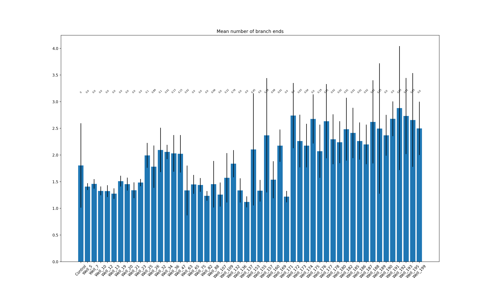
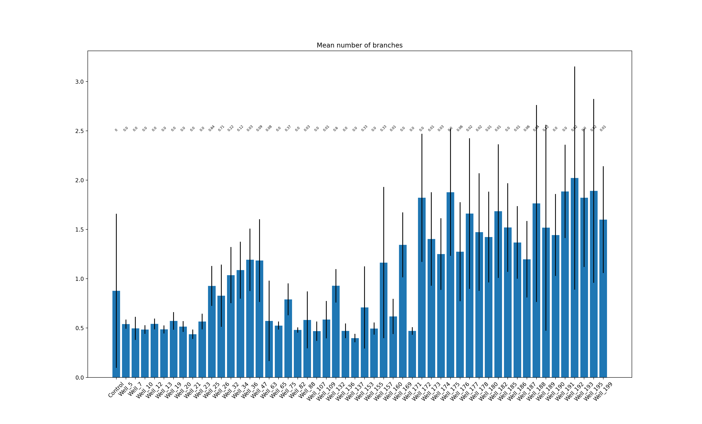

# drug-induced_morphology_changes_quantification
I treated iPSC with FDA approved drugs, stained them with neurite and nuclear markers and obtained confocal fluorescent images. Now, the goal is to quantify the change of neurites in each condition, namely 3 parameters: amount of trunk-branches (neurite branching from the body of the cell), non-trunk branching and mean length of neurites.

#Preamble
Human iPSC cells expressing abnormal HTT gene (mHTT) that plays an important role in Huntington's disease (HD) were cultured in 368-well plate, differentiated for 30 days and treated with a variety of FDA-approved substances for 48 hours.

After that, the cells were fixed and immunostained with fluorescent MAP2 antibody (a marker of neuronal dendrites), DAPI (nuclear marker) and anti-mHTT antibody.

Then, images were acquired using confocal microscope "Leica Thunder". For each well, 9 images were acquired for each channel, capturing each fluorescent signal separately.

The goal of the current analysis is to see if any changes in the cell morphology (specifically dendrites) are detectable after drug treatment. This analysis starts from the raw "ICC" (computationally cleared) images from Leica Thunder microscope. The softwares used was ImageJ version 1.53a and CellProfiler version 4.2.0. Statistical analysis and graphs done in Python3.

## 1. Raw images processing by ImageJ
Leica Thunder outputs the images in the .tif format. A plugin called "BioFormats" is needed to be able to open these images in ImageJ. The raw images are heavy so only a small subset (3 wells) are provided here in the link: https://drive.google.com/file/d/1-_7npYH_gfL7ygdyEGdGy22dfrbRwSuL/view?usp=sharing

The ImageJ macro provided (teat_macro_5jul.ijm) should be changed in the line

`saveAs("PNG", "/Users/maxxim333/Desktop/herrington/05_jul/imagej_output/"+originalName+"_cl.png");`

to match the desired output directory on your machine.

When running the macro (in Macro>Run) on ImageJ, it will ask you for input directory twice. Choose the same folder twice and let the program run. The macro does two things:
1. Automatically adjusts brightness and contrast of the image
2. Runs "despeckle" function that cleans the image from fluorescent noise a little bit.

The macro transforms &nbsp; &nbsp;&nbsp;&nbsp;  THIS &nbsp;  &nbsp;  &nbsp;  &nbsp;  &nbsp;  &nbsp;  &nbsp;  &nbsp;   into  &nbsp;  &nbsp;  &nbsp;  &nbsp; &nbsp;  &nbsp;  &nbsp;  &nbsp;  &nbsp;  &nbsp;  &nbsp;  &nbsp;  &nbsp; &nbsp; &nbsp;  THIS

 

## 2. Quantification of cell morphological parameters by CellProfiler
The PNG images outputed by ImageJ will serve as input data for CellProfiler. For each of the 9 images of each of the wells, it will identify and separate the nuclei based on the signal from DAPI channel. Then, it will superpose the MAP2 signal over the identified nuclei, "skeletize" the neurons (i.e. transform the neurite outlied in a one-pixel wide lines. From this superposed images, it will extract (for each nuclei) four main parameters:
1. The amount of neurites that originates from the nucleus.
2. The amount of branching points of all the neurons that originates from one particular nuclei
3. The amount of branch-ends
4. Total lenght of the neurites

It also calculates the means, medians and standart deviations of these metrics.

From these parameters, one could losely infer the morphology of the neuron as exemplified below:

The CellProfiler pipeline is provided ("pipeline_29jun.cpproj" file and when loaded, the following parameters need to be changed in order to match the directories of the new machine:
- In the "Images" step, output images from ImageJ macro should be loaded and the old ones removed from the list of images to process. 
- In "NamesAndTypes", click "Update". The images should be nicely paired. Each pair needs to have a DAPI and a MAP3 image and there should not be any unpaired images.
- In the OutputToSpreadsheet step, the "Default location" for the output needs to be changed.

After these changes, the program can be run. Ignore any messages that might arrise due to unused steps. The pipeline has some legacy steps. The steps the pipeline will do are illustrated in the image below.

The relevant data for this data will be stored in the specified output folder in a csv under the name of "MyExpt_Image.csv" and this csv will be the input of the python script that will compute and represent all relevant statistics.

## Statistical Analysis
The python script will analyse groups of nine rows (because we have 9 images per well, and therefore  nine rows of output per well in the csv file). Then, it will calculate the means and standart deviations of each cluster of 9 parameters means. The final output will include only statistics for those drugs that have at least one of the parameters above the control with p-value <=0.05 measured by Welch's t-test.

The file provided here called "MyExpt_Image_all.csv" can be used as input and it corresponds to a result of running ImageJ macro and CellProfiler pipeline on 288 wells (2592 image pairs).

The lines that need to be changed in the script are:

`with open('/Users/maxxim333/Desktop/herrington/05_jul/MyExpt_Image_all.csv') as file:` to desired input file name and location of said input file.

If working with a file different from the one provided, there is a need to change these lines:

`number_of_wells=288` to the number of wells you are working with (will always be number of images divided by 9)

`control = (array[np.r_[51:54,99:102,147:150,195:198]]).reshape(-1)` to specify which of the wells correspond to control (untreated wells)

The following chunk of code should include indices of the wells corresponding to control wells instead of the existing ones:

    `del means[52:55], means[97:100], means[142:145], means[187:190]`
    `del standart_deviations[52:55], standart_deviations[97:100], standart_deviations[142:145], standart_deviations[187:190]`
    `del pvalues[52:55], pvalues[97:100], pvalues[142:145], pvalues[187:190]`
    `del labels[52:55], labels[97:100], labels[142:145], labels[187:190]`

Finally the chunk of code below deals with missmatch of array indices between the array "significant" and the arrays defined within the function "ttestsignificant". The logical comparisons between the variable "j" and indices should be modified or deleted based on the specific layout of the. data and relative positions of the control wells:

            `if j==0:
                bar_x.append(labels[j])
                bar_height.append(means[j])
                bar_tick_label.append(labels[j])
                bar_label.append(pvalues[j])
                new_st.append(standart_deviations[j])
            elif j>0 and j<52:
                bar_x.append(labels[j+1])
                bar_height.append(means[j+1])
                bar_tick_label.append(labels[j+1])
                bar_label.append(pvalues[j+1])
                new_st.append(standart_deviations[j+1])
            elif j>=52 and j<100:
                bar_x.append(labels[j-2])
                bar_height.append(means[j-2])
                bar_tick_label.append(labels[j-2])
                bar_label.append(pvalues[j-2])
                new_st.append(standart_deviations[j-2])
            elif j >= 100 and j < 148:
                bar_x.append(labels[j - 5])
                bar_height.append(means[j - 5])
                bar_tick_label.append(labels[j - 5])
                bar_label.append(pvalues[j - 5])
                new_st.append(standart_deviations[j - 5])
            elif j>=148 and j<196:
                bar_x.append(labels[j - 8])
                bar_height.append(means[j - 8])
                bar_tick_label.append(labels[j - 8])
                bar_label.append(pvalues[j - 8])
                new_st.append(standart_deviations[j - 8])`

## 4. Results
From the data, the following results were generated:

A | B
- | - 
 | 

